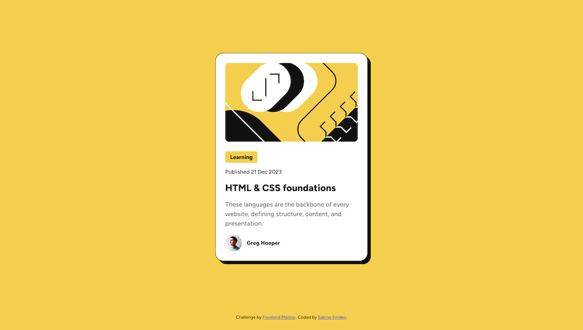

# Frontend Mentor - Blog preview card solution

This is a solution to the [Blog preview card challenge on Frontend Mentor](https://www.frontendmentor.io/challenges/blog-preview-card-ckPaj01IcS). Frontend Mentor challenges help you improve your coding skills by building realistic projects.

## Table of contents

- [Overview](#overview)
  - [The challenge](#the-challenge)
  - [Screenshot](#screenshot)
  - [Links](#links)
- [My process](#my-process)
  - [Built with](#built-with)
  - [What I learned](#what-i-learned)
  - [Continued development](#continued-development)
  - [Useful resources](#useful-resources)
- [Author](#author)
- [Acknowledgments](#acknowledgments)

## Overview

### The challenge

The brief for this project was to get the blog preview card looking as close to the design as possible, based on the following assets:

- Figma design files
- Mobile & desktop layouts
- Style guide with colors and fonts
- Optimized image assets
- Variable and static font files
- HTML file with pre-written contents

Users should be able to:

- See hover and focus states for all interactive elements on the page

### Screenshot



### Links

- [Frontend Mentor solution](https://www.frontendmentor.io/solutions/blog-preview-card-with-variable-font-and-fluid-typography-A811cD84il)
- [GitHub repository](https://github.com/SabineEmden/blog-preview-card)
- [Live Site](https://sabineemden.github.io/blog-preview-card/)

## My process

### Built with

- Semantic HTML5 markup
- Self-hosted variable web fonts
- Fluid typography

### What I learned

Three things in this challenge were new to me:

- Variable web fonts,
- Styling links in different states,
- Fluid typography.

This project has slightly smaller fonts sizes in the mobile layout than in the desktop layout. Fluid typography uses the CSS clamp function to reduce font sizes for smaller screens without using media queries.

The Figma file for this project gives three font sizes for the desktop design: 24px (1.5rem), 16px (1rem), and 14px (0.875rem). These are the upper font size limits for the fluid typography. The card component has a width of 384px (24rem) on desktop. With 24px padding on the body, the card component starts to shrink at a viewpoint width of 432px (27rem). This is the upper breakpoint.

The mobile design in the Figma file has a viewport width of 375px (23.4375rem). I rounded that to 23rem (368px) for the lower breakpoint. For the lower font size limits, I used the browser developer tools to find the font sizes that were closest to the mobile design: 1.2rem (19.2px), 0.84rem (13.4px) and 0.75rem (12px). These are the lower font size limits.

I used the [Fluid Typography Tool](https://fluidtypography.com/) to work out the CSS `camp()` functions.

For font sizes between 1.2rem (19.2px) and 1.5rem (24px):

```css
font-size: clamp(1.2rem, 7.5vw + -0.525rem, 1.5rem);
```

For font sizes between 0.84rem (13.44px) and 1rem (16px):

```css
font-size: clamp(0.84rem, 4vw + -0.08rem, 1rem);
```

For font sizes between 0.75rem (12px) and 0.875rem (14px):

```css
font-size: clamp(0.75rem, 3.125vw + 0.031rem, 0.875rem);
```

### Continued development

I could not find an online tool to subset the variable font (and keep it variable). I may have to look into command line tools, like [glyphhanger](https://github.com/zachleat/glyphhanger) by Zach Leatherman.

### Useful resources

- [MDN variable fonts guide](https://developer.mozilla.org/en-US/docs/Web/CSS/CSS_fonts/Variable_fonts_guide) - This guide gives a comprehensive introduction to variable fonts.
- [Getting started with Variable fonts on the web](https://www.youtube.com/watch?v=0fVymQ7SZw0) by Kevin Powell on YouTube - This video is another good introduction to variable fonts.
- [Wakamai Fondue](https://wakamaifondue.com/) - This site helped me find out what my font file can do via a simple drag-and-drop inspection interface.
- [MDN article on styling links](https://developer.mozilla.org/en-US/docs/Learn/CSS/Styling_text/Styling_links) - This article gives a good introduction to styling links in all their different states.
- [Modern Fluid Typography Using CSS Clamp](https://www.smashingmagazine.com/2022/01/modern-fluid-typography-css-clamp/) by Adrian Bece for Smashing Magazine - This article gives a comprehensive introduction to fluid typography.
- [Addressing Accessibility Concerns With Using Fluid Type](https://www.smashingmagazine.com/2023/11/addressing-accessibility-concerns-fluid-type/) by Maxwell Barvian for Smashing Magazine - This article addresses accessibility concerns mentioned in the previous article.

## Author

- Frontend Mentor - [@SabineEmden](https://www.frontendmentor.io/profile/SabineEmden)

## Acknowledgments

This project uses Josh Comeau's [CSS reset](https://www.joshwcomeau.com/css/custom-css-reset/).
